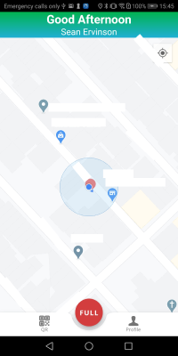
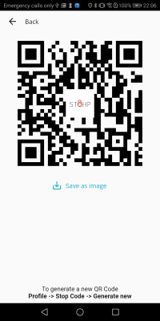

# Stohp Driver

Stohp Driver application is a driver utility application that aims to give driver better experience. This is a two part app you can find the main application [here](https://github.com/SeanErvinson/stohp-app).

## Application




## Prerequisite
- Android IDE
- Android SDK 28 or Oreo above

## Getting Started

Clone the project or download the zip file.
```
git clone <project_url>
```

To run the application. Open an emulator or connect an appropriate device.
```
flutter run
```

Google Map API key is required to run the map. For more information check out
https://pub.dev/packages/google_maps_flutter